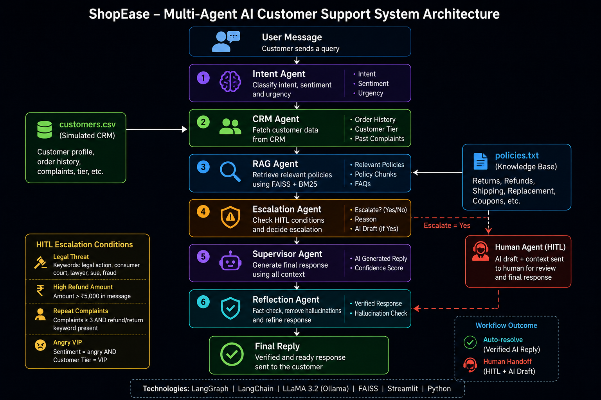
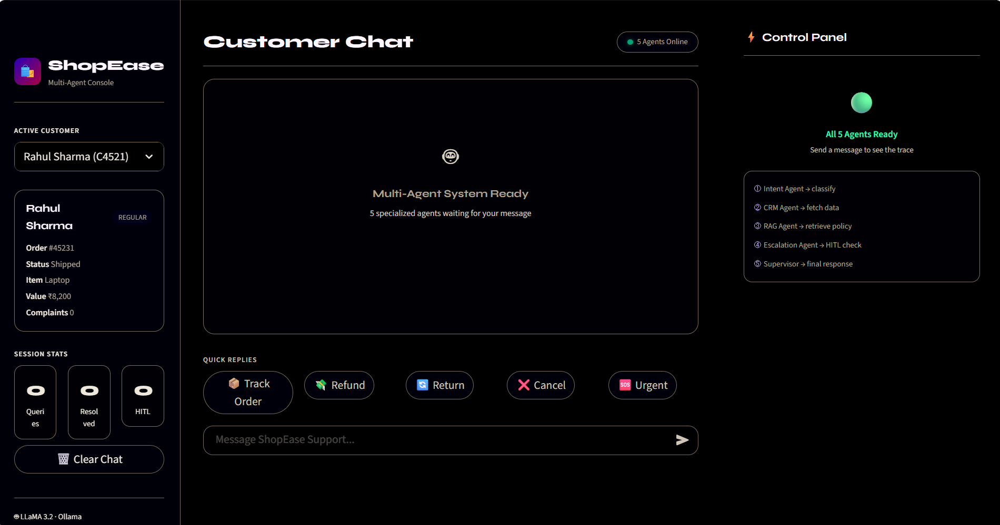
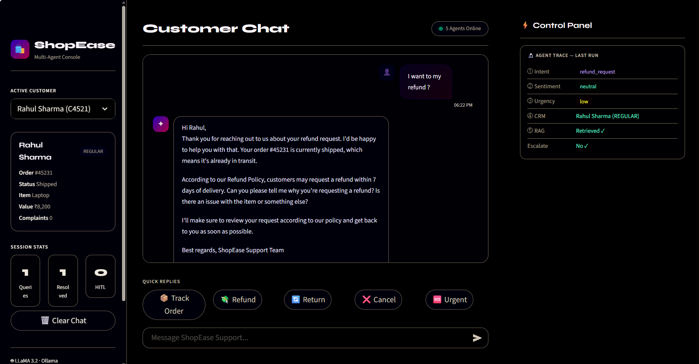
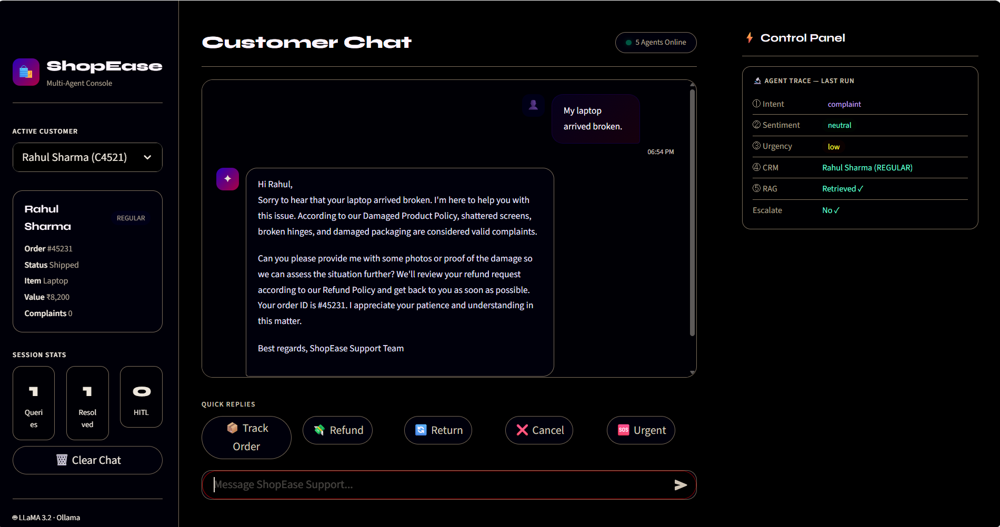
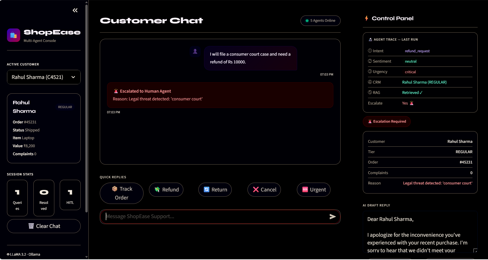
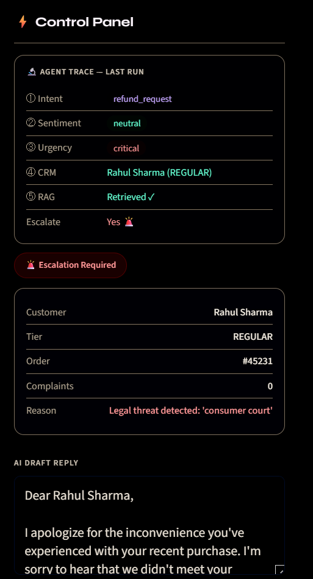
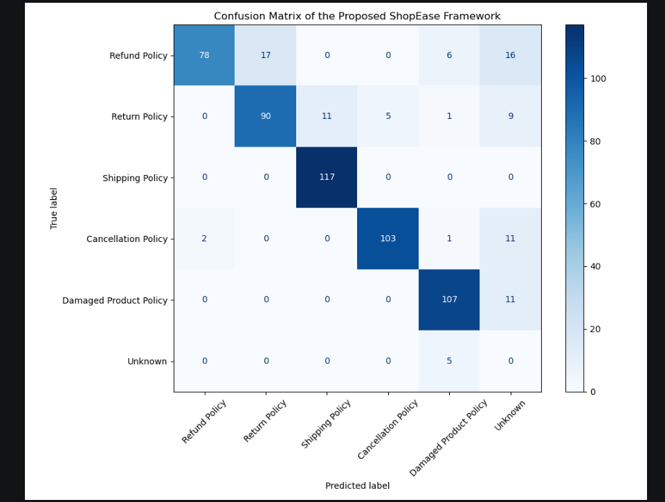

# 🛍️ ShopEase — Multi-Agent AI Customer Support System

> A production-inspired **Multi-Agent AI** system built with LangGraph — where 5 specialized agents collaborate to autonomously resolve customer queries using RAG-based knowledge retrieval, CRM-aware personalization, and Human-in-the-Loop escalation.


---


## 📌 What is this?

ShopEase is a **Multi-Agent AI Customer Support pipeline** that demonstrates how modern Agentic AI systems work in real-world scenarios. Unlike a simple chatbot or single-agent system, this project uses **5 specialized agents** orchestrated by LangGraph — each with a specific role.

This project demonstrates an end-to-end Agentic AI customer support workflow combining Multi-Agent Systems, Retrieval-Augmented Generation (RAG), Human-in-the-Loop (HITL), and response verification using a Reflection Agent.

**Key concepts demonstrated:**
- Multi-agent orchestration with LangGraph
- RAG (Retrieval-Augmented Generation) with FAISS
- Human-in-the-Loop (HITL) escalation
- CRM-aware personalized responses
- Local LLM inference — zero API cost

---

## 🤖 The 6 Agents

| Agent | Role | Input | Output |
|---|---|---|---|
| **Intent Agent** | Classifies message intent & sentiment | User message | intent, sentiment, urgency |
| **CRM Agent** | Fetches customer data | Customer ID | order status, history, tier |
| **RAG Agent** | Retrieves relevant policies | User query | policy chunks from FAISS |
| **Escalation Agent** | Checks HITL conditions | Message + customer data | escalate? + AI draft |
| **Supervisor Agent** | Generates final response | All agent outputs | final reply or HITL handoff |
| Reflection Agent | Fact-checks and removes hallucinations | Generated response | Corrected final response |

---

## 🏗️ Multi-Agent Architecture

```text
                ┌─────────────────┐
                │  User Message   │
                └────────┬────────┘
                         │
                         ▼
                ┌─────────────────┐
                │ Intent Agent    │
                │ Intent + Sent.  │
                └────────┬────────┘
                         │
                         ▼
                ┌─────────────────┐
                │ CRM Agent       │
                │ Customer Data   │
                └────────┬────────┘
                         │
                         ▼
                ┌─────────────────┐
                │ RAG Agent       │
                │ Policy Retrieval│
                └────────┬────────┘
                         │
                         ▼
                ┌─────────────────┐
                │ Escalation      │
                │ HITL Decision   │
                └────────┬────────┘
                         │
             ┌───────────┴───────────┐
             │                       │
             ▼                       ▼
      ┌──────────────┐       ┌──────────────┐
      │ Supervisor   │       │ Human Agent  │
      │ Generate Ans │       │ AI Draft     │
      └──────┬───────┘       └──────────────┘
             │
             ▼
      ┌──────────────┐
      │ Reflection   │
      │ Fact Check   │
      └──────┬───────┘
             │
             ▼
      ┌──────────────┐
      │ Final Reply  │
      └──────────────┘
```
### System Architecture



---

## 🎬 Demo Scenarios

| Customer | Message | What happens |
|---|---|---|
| Rahul Sharma | "Where is my order?" | ✅ AI responds with order status |
| Rahul Sharma | "My order is 5 days late" | ✅ AI applies ₹50 coupon policy |
| Rahul Sharma | "My laptop is damaged, I want refund and return policy" | ✅ AI answers BOTH questions in one response |
| Priya Mehta | "I want a refund" | 🚨 HITL — 5 unresolved complaints |
| Anyone | "I will take legal action" | 🚨 HITL — legal keyword detected |
| Anyone | "I want Rs 10000 refund" | 🚨 HITL — amount exceeds threshold |
| Angry VIP | Any message with anger | 🚨 HITL — VIP + angry sentiment |

---

## 💡 Why Multi-Agent over Single Agent?

| Scenario | Single Agent | Multi-Agent |
|---|---|---|
| "Refund + return policy both?" | ❌ Handles only one | ✅ RAG fetches both simultaneously |
| Complex query routing | ❌ One function does everything | ✅ Specialized agent per task |
| Agent transparency | ❌ Black box | ✅ Live trace panel shows each agent |
| Error isolation | ❌ One failure = full failure | ✅ Each agent fails independently |
| Scalability | ❌ Hard to extend | ✅ Add new agent easily |

---

## ⚙️ Tech Stack

| Layer | Technology | Purpose |
|---|---|---|
| Multi-Agent Framework | LangGraph | Agent graph, state management, routing |
| LLM | LLaMA 3.2 via Ollama | Local inference — zero API cost |
| Orchestration | LangChain Core | Prompt templates, output parsers |
| Vector DB | FAISS (local) | Semantic policy retrieval |
| Embeddings | Ollama Embeddings | Text → vector conversion |
| CRM | CSV + Pandas | Simulated customer database |
| UI | Streamlit | Dark theme chat interface |
| Language | Python 3.10+ | Backend logic |

---

## 📁 Project Structure

```
shopease-multiagent/
│
├── app.py                        ← Streamlit UI with dark theme + agent trace
│
├── graph/
│   ├── state.py                  ← Shared AgentState (TypedDict)
│   ├── workflow.py               ← LangGraph graph assembly + run_graph()
│   ├── supervisor.py             ← Supervisor Agent (final response)
│   └── nodes/
│       ├── intent_agent.py       ← Intent + sentiment classification
│       ├── crm_agent.py          ← Customer data fetcher
│       ├── rag_agent.py          ← FAISS retrieval
│       └── escalation_agent.py   ← HITL logic + draft generation
│
├── data/
│   ├── customers.csv             ← Simulated CRM (5 test customers)
│   └── policies.txt              ← Knowledge base (FAQs + policies)
│
├── .gitignore
├── requirements.txt
└── README.md
```

---

## 🚀 Getting Started

### Prerequisites
- Python 3.10+
- [Ollama](https://ollama.com/download) installed

### Step 1 — Install Ollama and pull LLaMA 3.2

```bash
# Download from https://ollama.com/download
ollama pull llama3.2
```

### Step 2 — Clone the repository

```bash
git clone https://github.com/Asrawndhe/shopease-multiagent.git
cd shopease-multiagent
```

### Step 3 — Install dependencies

```bash
pip install -r requirements.txt
```

### Step 4 — Run the app

```bash
streamlit run app.py
```

Visit **http://localhost:8501**

> The FAISS vector store builds automatically on first message — no separate setup needed.

---

## 🛡️ HITL Trigger Conditions

| Condition | Rule |
|---|---|
| Legal threat | Keywords: "legal action", "consumer court", "lawyer", "sue", "fraud" |
| High refund amount | Amount > ₹5,000 mentioned in message |
| Repeat complaints | complaints ≥ 3 **AND** refund/return keyword present |
| Angry VIP | sentiment = "angry" **AND** customer tier = "VIP" |

---

## 🔬 Agent Trace Panel

Every message shows a **live agent trace** in the right panel:

```
① Intent    →  order_tracking  [purple badge]
② Sentiment →  neutral         [green badge]
③ Urgency   →  medium          [yellow badge]
④ CRM       →  Rahul (REGULAR) [green]
⑤ RAG       →  Retrieved ✓     [green]
   Escalate →  No ✓            [green]
```

This makes the multi-agent system fully transparent — you can see exactly what each agent decided.

---

## 🗺️ Production Upgrade Path

| This Project (Demo) | Production Version |
|---|---|
| FAISS in-memory | Pinecone / Qdrant |
| CSV fake CRM | Salesforce / HubSpot API |
| Rule-based intent | Fine-tuned classifier |
| Sequential agents | Parallel agent execution |
| Streamlit UI | React + FastAPI |
| No tracing | LangSmith observability |

---

## 👤 Author

### Ashish Rawandhe

AI Engineer | Data Science & Agentic AI Enthusiast

* GitHub: https://github.com/Asrawandhe
* LinkedIn: https://linkedin.com/in/asrawandhe

---

## ✨ Key Features

* Multi-Agent AI workflow using LangGraph
* RAG-powered policy retrieval with FAISS
* CRM-aware personalized responses
* Human-in-the-Loop escalation pipeline
* Local LLM inference using Ollama
* Real-time agent trace visualization
* Modular and production-scalable architecture
* Reflection Agent for hallucination reduction and fact checking
* Hybrid Retrieval (FAISS + BM25)
* Evaluation pipeline with confusion matrix and latency analysis

---

## 📊 Evaluation Results

| Metric | Value |
|--------|--------|
| Hybrid Retrieval Accuracy | 83.19% |
| BM25 Accuracy | 54.65% |
| FAISS Accuracy | 54.65% |
| Macro F1 Score | 0.725 |
| Weighted F1 Score | 0.863 |
| Average Response Latency | < 2 sec |

The Hybrid Retrieval approach (FAISS + BM25) significantly outperformed individual retrieval methods and improved policy retrieval quality for customer support queries.

---

## 📈 Future Improvements

* Add memory-enabled conversational agents
* Parallel agent execution
* Docker deployment
* FastAPI backend integration
* LangSmith tracing & monitoring
* PostgreSQL / Redis integration
* Voice support using Whisper + TTS
* Authentication & admin dashboard

---

[](https://linkedin.com/in/asrawandhe)
[](https://github.com/Asrawndhe)

---

## 📄 License

MIT License — free to use, modify, and distribute.

---

<div align="center">
  <sub>🛍️ Built with LLaMA 3.2 · LangGraph · LangChain · FAISS · Streamlit · Python</sub>
</div>

## Screenshots

### 1. Homepage


### 2. Refund Query Response


### 3. Damaged Product Query


### 4. Human-in-the-Loop (HITL) Escalation


### 5. Control Panel


### 6. Confusion Matrix


### 7. Accuracy Comparison


### 8. Latency Comparison


### 9. Classification Report


## 📊 Evaluation

| Metric | Value |
|--------|--------|
| Hybrid Retrieval Accuracy | 83.19% |
| Macro F1 Score | 0.725 |
| Weighted F1 Score | 0.863 |
| Average Latency | < 2 sec |

### Confusion Matrix


### Accuracy Comparison


### Latency Analysis


### Classification Report
